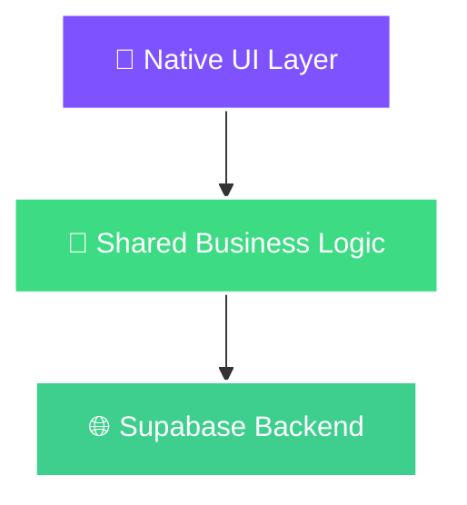

<div align="center">


# ✨ Synapse Social

<h3>
  <samp>
    The Future of Social Networking
  </samp>
</h3>

<p>
  <em>Native Performance • Multiplatform Architecture • Privacy-First Design</em>
</p>

<br/>

[](https://developer.android.com/)
[](https://kotlinlang.org/)
[](https://developer.android.com/jetpack/compose)
[](https://supabase.com/)

<br/>

```
┌─────────────────────────────────────────────────────────────┐
│  🎯 One Codebase  •  🌍 Multiple Platforms  •  🔒 Secure   │
└─────────────────────────────────────────────────────────────┘
```

[Features](#-features) • [Architecture](#-architecture) • [Quick Start](#-quick-start) • [Structure](#-structure)

</div>

<br/>

---

<br/>

## ✨ Features

<table>
<tr>
<td width="50%">

### 🌐 Cross-Platform Core
Built with **Kotlin Multiplatform**, sharing business logic across Android, iOS, and Web. Write once, deploy everywhere.

</td>
<td width="50%">

### 🎨 Modern UI
Crafted with **Jetpack Compose** for Android and **SwiftUI** for iOS. Fluid animations, native feel.

</td>
</tr>
<tr>
<td width="50%">

### 🔐 Privacy First
End-to-end encryption planned. Your data, your control. Built on **Supabase** infrastructure.

</td>
<td width="50%">

### ⚡ Native Performance
No compromises. Native UI layers ensure buttery-smooth 120fps experiences.

</td>
</tr>
</table>

<br/>

---

<br/>

## 🏗️ Architecture

<div align="center">



</div>

<br/>

<table>
<tr>
<th>Layer</th>
<th>Technology</th>
<th>Responsibility</th>
</tr>
<tr>
<td><strong>🎨 UI</strong></td>
<td>Compose • SwiftUI</td>
<td>Native platform rendering</td>
</tr>
<tr>
<td><strong>🧠 Logic</strong></td>
<td>Kotlin Multiplatform</td>
<td>Business rules, networking, repositories</td>
</tr>
<tr>
<td><strong>🌐 Backend</strong></td>
<td>Supabase</td>
<td>Auth, database, storage, edge functions</td>
</tr>
</table>

> **🤖 AI Agents:** Review [AGENTS.md](AGENTS.md) for contribution guidelines and architecture rules.

<br/>

---

<br/>

## 🚀 Quick Start

<table>
<tr>
<td>

### 1️⃣ Clone Repository
```bash
git clone https://github.com/your-org/synapse-android.git
cd synapse-android
```

</td>
</tr>
<tr>
<td>

### 2️⃣ Configure Environment
Create `gradle.properties` with your Supabase credentials:
```properties
SUPABASE_URL=your_project_url
SUPABASE_ANON_KEY=your_anon_key
```

</td>
</tr>
<tr>
<td>

### 3️⃣ Build & Run
Open in **Android Studio Ladybug** or newer, then launch the `app` configuration.

</td>
</tr>
</table>

<br/>

---

<br/>

## 📂 Structure

```
synapse/
├── 📱 app/          # Android UI & ViewModels
├── 🧩 shared/       # Kotlin Multiplatform Engine
│   ├── domain/      # Business logic & use cases
│   ├── data/        # Repositories & data sources
│   └── network/     # API clients (Ktor + Supabase)
└── 🍎 iosApp/       # iOS SwiftUI Application
```

<br/>

---

<br/>

<div align="center">

### 🌟 Built with Passion

<sub>Crafted with ❤️ by the **Synapse Team**</sub>

<br/>

<sub>Licensed under [AGPLv3](LICENSE) • Open Source • Community Driven</sub>

<br/><br/>


<br/><br/>

**[⬆ Back to Top](#-synapse-social)**

</div>
