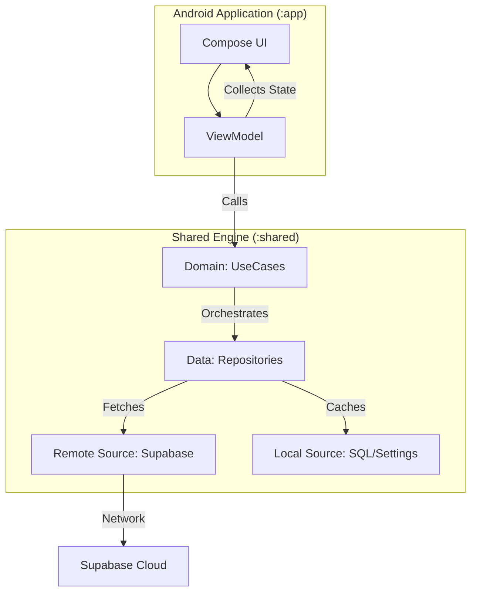

# 🏗️ Architecture

This document describes the high-level architecture of Synapse Social. The application follows a **Clean Architecture** approach, currently transitioning towards a **Kotlin Multiplatform (KMP)** structure where the core "Engine" is shared, and the UI is native.

## 📐 High-Level Overview

The system is divided into two primary zones: the **Platform Specific (Android)** layer and the **Shared Engine (KMP)** layer.



### ASCII Diagram

```text
+---------------------------------------------------------------+
|                      ANDROID APP (:app)                       |
|                                                               |
|  [ Activity / Fragment ]                                      |
|        |                                                      |
|  [ Jetpack Compose Screens ] <--- (StateFlow) ----+           |
|        |                                          |           |
|        v                                          |           |
|  [ ViewModel (Hilt) ] ----------------------------+           |
|        |                                                      |
+--------|------------------------------------------------------+
         | (Function Calls)
         v
+---------------------------------------------------------------+
|                    SHARED ENGINE (:shared)                    |
|                      (commonMain)                             |
|                                                               |
|  [ Domain Layer ]                                             |
|     - UseCases / Interactors                                  |
|     - Domain Models (Pure Kotlin)                             |
|                                                               |
|         |                                                     |
|         v                                                     |
|  [ Data Layer ]                                               |
|     - Repositories (Interface + Impl)                         |
|     - DTOs (Data Transfer Objects)                            |
|                                                               |
|     +------------------+       +------------------+           |
|     |  Remote Source   |       |   Local Source   |           |
|     | (Supabase Ktor)  |       | (SQLDelight/Room)|           |
|     +------------------+       +------------------+           |
+---------------------------------------------------------------+
```

---

## 🧱 Layers & Responsibility

### 1. Presentation Layer (Android)
- **Location:** `app/src/main/java/.../ui` & `feature`
- **Tech:** Jetpack Compose, Material3.
- **Responsibility:** Rendering the UI and capturing user input. **No business logic allowed.**
- **State:** UI state is managed by `ViewModels` and exposed via `StateFlow`.

### 2. ViewModel Layer (Android -> Shared Bridge)
- **Location:** `app/src/main/java/.../feature`
- **Tech:** Android ViewModel, Hilt.
- **Responsibility:**
    - Converts Domain models to UI state.
    - Handles UI events (clicks, navigation).
    - Launches coroutines to call UseCases.
    - **Note:** In the future, ViewModels may move to Shared (KMP ViewModels).

### 3. Domain Layer (Shared)
- **Location:** `shared/src/commonMain/kotlin/.../domain`
- **Tech:** Pure Kotlin.
- **Responsibility:** Encapsulates business logic.
    - **UseCases:** Single-responsibility classes (e.g., `LoginUserUseCase`).
    - **Models:** Pure data classes used by the app core.

### 4. Data Layer (Shared)
- **Location:** `shared/src/commonMain/kotlin/.../data`
- **Tech:** Ktor, Supabase-kt, SQLDelight/Room.
- **Responsibility:** Single source of truth for data.
    - Coordinate between Remote (API) and Local (Cache).
    - Map DTOs (Network models) to Domain models.

---

## 🚦 Boundaries & Rules

1.  **Dependency Rule:** Dependencies only point **inwards**. UI depends on Domain. Data depends on Domain. Domain depends on nothing.
2.  **Platform Isolation:** The `shared` module (specifically `commonMain`) cannot access Android APIs (`android.*`).
3.  **Unidirectional Data Flow:** Events go up (UI -> ViewModel), State flows down (ViewModel -> UI).

---

## ⚠️ KMP Migration Notes
We are in a **hybrid state**.
- Legacy code may still exist in `app/src/main/.../data`.
- **New Feature Rule:** All *new* business logic and data handling **must** be implemented in `:shared`.
- **Legacy Refactor:** When touching legacy Android-only repositories, plan to migrate them to `:shared`.
