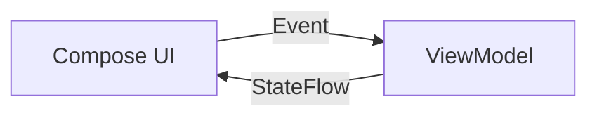

# 🔄 State Management

We utilize **Unidirectional Data Flow (UDF)** to manage state predictably.

## 📐 The Pattern

1.  **Event:** The UI (Compose) sends an `Event` (User Action) to the ViewModel.
2.  **Process:** The ViewModel processes the event, interacts with the Domain layer, and updates the `State`.
3.  **Render:** The UI collects the `State` and recomposes.



---

## 🏛️ ViewModel Structure

Each screen/feature has a dedicated ViewModel implementing this pattern:

```kotlin
@HiltViewModel
class LoginViewModel @Inject constructor(
    private val loginUseCase: LoginUseCase
) : ViewModel() {

    // 1. Backing Mutable State
    private val _uiState = MutableStateFlow<LoginUiState>(LoginUiState.Idle)

    // 2. Public Immutable State
    val uiState: StateFlow<LoginUiState> = _uiState.asStateFlow()

    // 3. Event Handler
    fun onLoginClick(email: String, pass: String) {
        viewModelScope.launch {
            _uiState.value = LoginUiState.Loading
            val result = loginUseCase(email, pass)
            _uiState.value = when(result) {
                is Result.Success -> LoginUiState.Success
                is Result.Error -> LoginUiState.Error(result.message)
            }
        }
    }
}
```

## 🎨 Compose Integration

Use `collectAsStateWithLifecycle()` for safe state collection.

```kotlin
@Composable
fun LoginScreen(
    viewModel: LoginViewModel = hiltViewModel()
) {
    // Collect state lifecycle-aware
    val state by viewModel.uiState.collectAsStateWithLifecycle()

    when(state) {
        is LoginUiState.Idle -> LoginForm(...)
        is LoginUiState.Loading -> LoadingSpinner()
        is LoginUiState.Success -> NavigateHome()
        is LoginUiState.Error -> ErrorMessage(...)
    }
}
```

---

## 🧠 Shared State (Global)

For global state (e.g., Session, Theme, Connectivity):
- Manage it in a **Singleton Repository** or **Shared Manager** in the `shared` module.
- Observe it in the ViewModel and map it to the UI State.
- **Do not** hold state in static objects or the `Application` class.

## ⚠️ Anti-Patterns
- ❌ Modifying `uiState` directly from the View.
- ❌ Exposing `MutableStateFlow` to the View.
- ❌ Performing complex logic inside the `when(state)` block in Compose.
