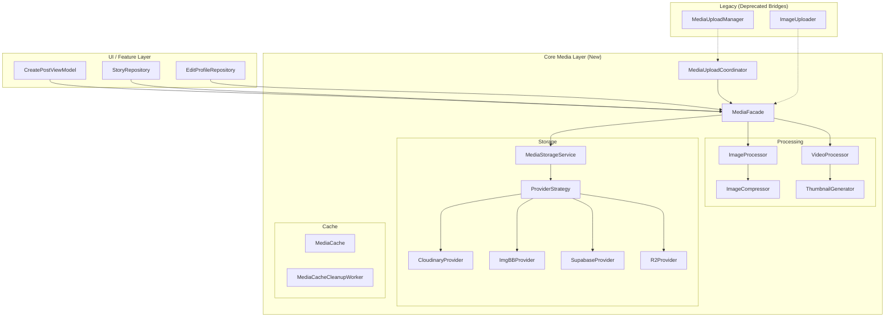

# Media Architecture Diagram

```mermaid
graph TD
    subgraph "UI / Feature Layer"
        CPVM[CreatePostViewModel]
        SR[StoryRepository]
        EPR[EditProfileRepository]
    end

    subgraph "Core Media Layer (New)"
        MF[MediaFacade]
        MUC[MediaUploadCoordinator]

        subgraph "Processing"
            IP[ImageProcessor]
            VP[VideoProcessor]
            IC[ImageCompressor]
            TG[ThumbnailGenerator]
        end

        subgraph "Storage"
            MSS[MediaStorageService]
            PS[ProviderStrategy]
            CP[CloudinaryProvider]
            IB[ImgBBProvider]
            SP[SupabaseProvider]
            R2[R2Provider]
        end

        subgraph "Cache"
            MC[MediaCache]
            MCCW[MediaCacheCleanupWorker]
        end
    end

    subgraph "Legacy (Deprecated Bridges)"
        IU[ImageUploader]
        MUM[MediaUploadManager]
    end

    CPVM --> MF
    SR --> MF
    EPR --> MF
    MUC --> MF

    MF --> IP
    MF --> VP
    MF --> MSS

    IP --> IC
    VP --> TG

    MSS --> PS
    PS --> CP
    PS --> IB
    PS --> SP
    PS --> R2

    IU -.-> MF
    MUM -.-> MUC
```
